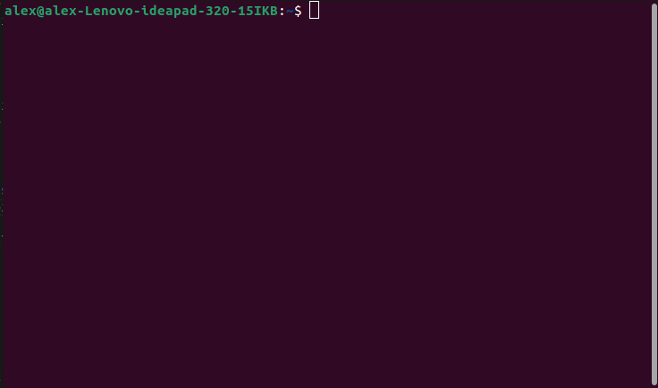

Hi, If your reading this you probably joined robotics (or a computer teacher is using this site to help you teach the basics of python for a class). Let's get started shall we?

So if you look at the bottom left of your keyboard, you will see the windows key (how ironic..) once you hit that key you might see something like this:


Once in this screen hit the little button that looks like 9 squares in a cube or click up here:


Once its highlighted/selected type in "Terminal" (caps friendly meaning you don't need to capitalize the T)


Once you open terminal you might see something like this: 



but a little different, probably a gray background with white text and a different starting coommand. (thats probably because you are on fedora and i am on ubuntu)

When you have terminal opened you need to run the python command. To do that you type:
```
python3
```
If you see
```
Python 3.9.7 (default, Sep 10 2021, 14:59:43) 
[GCC 11.2.0] on linux
Type "help", "copyright", "credits" or "license" for more information.
>>> 
```
Then you did it right. If you see anything a version that says "Python 2.x.x" then you probably typed 
```
python
```

Which is probably not where you want to head off to as its been deprecated as of the year 2020.

Since you know how to run python you can now head off onto lesson 1!

[Arithmetics](arithmetic.md)

Or if you want to you can head off to [the history](foreward.md) of how robotics started in school or view who this new tutorial/intro is dedicated to [here](dedication.md).