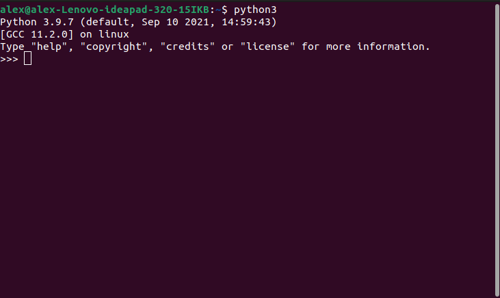

<p style="color:white"> 
So if your reading this you've probably gotten past the [getting started](getstarted.md) phase and (if your probably under grade 7-8) you're probably wondering what does arithmetics mean? Well its basically a fancy way of saying algebra or math. Before you start going "ughhhh why are we learning math in computer" you're not. Your actually going to see how python can do math for you. So if you're in grade 8 or up you probably understand radicals and squaring (radical is the root of a number like square root, cube root, etc.) If you dont then basically the square root is the opposite of the square. So let's say you square the number 5. It would be 5x5. If you know the basic multiplication tables then you know the answer is 25. Square rooting that you would get 5. Let's do some examples in python now, shall we?
</p>
<p style="color:white"> 
If you were paying attention or focusing in the getting started then you know how to open python. So go do that now.
</p>
<p style="color:white"> 
Once you have it open you will see something like this:
</p>



<p style="color:white"> 

Obviously you will get errors from time to time and you need to understand the error code to know where you went wrong. So for example if you typed:
</p>

```
02+
```
<p style="color:white"> 

and nothing else you would get an error code that says:
</p>

```
SyntaxError: leading zeros in decimal integer literals are not permitted; use an 0o prefix for octal integers
```
<p style="color:white"> 

Leading 0's means theres a 0 before the number and python likes to be picky so if you want to have a leading 0 you have to put an "o" after the 0. Let's try that. Put in 
</p>

```
0o2+
```
<p style="color:white"> 

and see what comes out.
</p>
<p style="color:white"> 

Obviously there'll be an error but a different one. Something that looks like this:
</p>


```
  File "<stdin>", line 1
    0o2+
        ^
SyntaxError: invalid syntax
```
<p style="color:white"> 

So let's first understand the syntax error. Syntax error basically means you have a typo somewhere in your command/code. If your running the file through an external program (for example you coded a python file and ran it with the python3 "filename") then where it says "stdin" it would change to the name of the file and show which line and where. Since we are running it on terminal the stdin is a temporary cache file that will delete after the command is ran. So if we add another integer at the end we will get a working command. So go try any set of numbers and add them together.
</p>
<p style="color:white"> 

Once you finished doing that we can start on showing what other calculations can be done.
</p>
<p style="color:white"> 

Theres 4 basic symbols:
 - "+"
 - "-"
 - "*"
 - "/"
</p>
<p style="color:white"> 

Sorry for having to put it in "" markdown doesn't like it if its not in those. So its obvious which does what. So those are your basic symbols. 
</p>

<p style="color:white"> 

If you wanna square a number its basically using the multiplication symbol twice. So for example if you did it now you would see something along the lines of this depending on what numbers you choose. Me personally I like just doing a basic small number.
</p>

```
900**65
```

<p style="color:white"> 

If I were to do that now I would see something like this:
</p>


<p style="color:white"> 

Go ahead try and have fun with squaring numbers. 
</p>

<p style="color:white"> 

<p style="color:red">Task:</p>

</p>
<p style="color:white">
If you read and understood this lesson you will be able to do this task:
</p>

<p style="color:white">
What is the square root of 1800. Do this in python.
</p>

| [Go back](getstarted.md) | [Table of contents](contents.md) | [Next lesson](print.md) |
