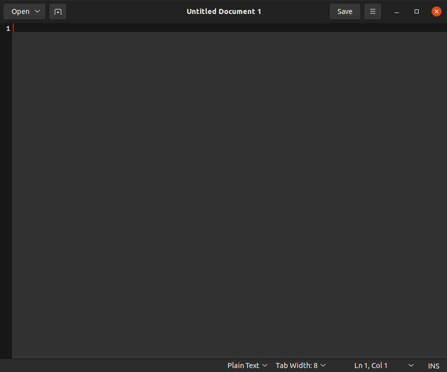

So external programming, now is where you'll start having the fun I can *definitely* promise that. So depending on which editer you decide to use. *in my preference it's visual studio code, but since you'll need to cheat your way around it I'll put an access link and a tutorial for it's work around if you want to use it*. The base line editer for linux is something called "**Text Editor**". It's ugly. *especially on ubuntu*. Once you open it you'll see something like this:

if you decide to use this application you will see at the bottom bar where it says "**Plain Text**" if you click on that you will see a menu and at the top of the menu you will see a search bar. Select it and type python. You might end up seeing 2 options, "**Python**" and "**Python 2**". Since it's obvious we aren't working on Python 2, select python. 