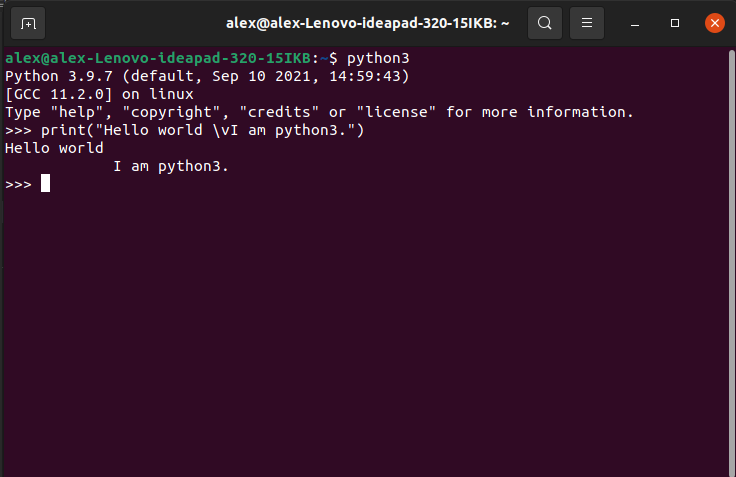

<p style="color:white">Okay so since you are here you probably finished the previous lesson Arithmetics. If you skipped it go back to it and do it. If you didnt do the task I'd suggest you go and do the task as it would be a good idea to make sure you understood the lesson. If you passed the task then great job now time to start on the</p>

```python
print()
```

<p style="color:white">function. Before you think this is printing like a document or a pdf or something it isn't it's printing something into the *console so for example (preferrably open python now if you closed it) if you typed</p>

```python
print("Hello world \vI am python3.")
```

<p style="color:white">you would get a reply that's something like this: </p>



<p style="color:white">Now you might be wondering "Why does the I am python3 show a large indent?" Well the \v moves the sentence to a new line and adds an indent.</p>

<p style="color:white">But theres 1 more you can use.</p>

`\n` 
<p style="color:white">

`\n` goes to a new line without the indent</p>

<p style="color:red">Task:</p>

<p style="color:white">So I will put an errored code here and it's your job to try and get it working in terminal. There will be 2 sets of code one for `\v` and one for `\n`. 
</p>

`\v`:
```python
print{"Hello world \ v i am python3']
```

`\n`
```python
print[Hello world /n i am python3}
```
<p style="color:white">*Console : The terminal. I prefer to use console as I'm more used to it. </p>

|[Arithmetics](arithmetic.md)|[Table of contents](contents.md)|[External programs](external-programs.md)|